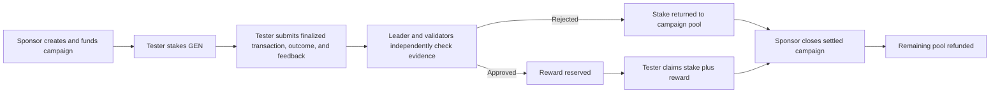

# VerdictProof

[](https://github.com/tanphung/VerdictProof/actions/workflows/ci.yml)

**Product-testing campaigns settled by independent GenLayer validation.**

VerdictProof lets a sponsor fund a testing campaign and define a real product task. A tester stakes GEN, completes the task, and submits a finalized Bradbury transaction, public outcome evidence, and written feedback. GenLayer validators independently assess the evidence before the Intelligent Contract settles the submission as approved or rejected.

VerdictProof is a controlled public pilot with real on-chain workflows. The verified release demonstrates protocol behavior on Bradbury; it does not claim external user adoption.

## Live Release

| Surface | Verified release |
| --- | --- |
| Live dApp | [verdictproof.vercel.app](https://verdictproof.vercel.app) |
| Source repository | [github.com/tanphung/VerdictProof](https://github.com/tanphung/VerdictProof) |
| Bradbury contract | [`0xF979...aBed`](https://explorer-bradbury.genlayer.com/address/0xF97993930eCb9e30efd77C0f2AaEE29f4d34aBed) |
| Deployment transaction | [`0x7cb3...4e6a`](https://explorer-bradbury.genlayer.com/tx/0x7cb311efeef196d8fcdfae904e43cc21ab1767517453135aa11fc3b3c0a24e6a) |
| Intelligent Contract | [contracts/verdict_proof.py](contracts/verdict_proof.py) |
| Public verification artifact | [deploy/latest-bradbury-verification.json](deploy/latest-bradbury-verification.json) |
| Submission and demo notes | [SUBMISSION.md](SUBMISSION.md) |
| License | [MIT](LICENSE) |

The V2.3 deployment reached `FINALIZED / AGREE / FINISHED_WITH_RETURN` with 5/5 recorded votes. Its deployed source and generated schema match this repository. The canonical source SHA-256 is:

```text
5c5624351a4de6f1e79c58ce7595b7837053b03128637e7cfbf7e95776da4d33
```

## The Trust Problem

Traditional reward campaigns can verify that a form was submitted, but not whether someone actually completed a product task or provided useful feedback. This creates an incentive to submit unrelated transactions, copied comments, or generic praise.

Deterministic code can enforce campaign ownership, exact funding, tester stake, claim rules, and one-time settlement. It cannot reliably decide whether public evidence proves a natural-language task or whether feedback is specific, useful, and original.

VerdictProof uses GenLayer only at that evidence boundary:

1. A sponsor publishes the task, proof requirement, reward, stake, and approval threshold.
2. A tester stakes the exact required GEN and submits public evidence.
3. The contract reads the finalized Bradbury receipt and derives execution and wallet identity from RPC data.
4. The leader and validators independently evaluate the product outcome and written feedback with the same versioned rubric.
5. Consensus commits the verdict and detailed report to contract state.
6. Approved testers claim stake plus reward; rejected stake returns to the campaign pool.
7. Once no submission remains pending, the sponsor closes the campaign and withdraws the remaining pool.

GenLayer is therefore the settlement layer, not an AI label added to an otherwise off-chain product.

## Product Lifecycle



## Independent Validation

Every review separates objective evidence gates from semantic judgment.

### Objective gates

- The submitted receipt must be finalized.
- Consensus and execution must indicate successful execution.
- The receipt sender must match the submitting tester wallet.
- The transaction recipient and decoded call must represent the submitted workflow.
- The outcome URL must use the campaign product origin.

Execution or identity failure takes the hard-gate path without rendering the outcome. These facts are derived from the Bradbury receipt, not accepted from an LLM response.

### Semantic review

When the receipt and identity gates pass, every node independently renders the public outcome and evaluates:

- task completion and proof quality: 40 points;
- feedback specificity and grounding: 25 points;
- usefulness and product insight: 20 points;
- originality: 15 points.

Validators require exact agreement on material evidence gates and the decision side of the campaign threshold. Subjective components use anchored scores and bounded tolerances. Malformed LLM output produces validator disagreement and rotation rather than a synthetic rejection.

### Report provenance

The contract stores the leader report only after independent validators agree on the evidence gates, decision, threshold side, and score tolerances. Narrative fields are therefore the consensus-committed leader report, not separate transcripts from individual validators.

The frontend:

- reads campaign and report fields from finalized GenLayer contract state;
- does not synthesize missing validator analysis or rationale;
- labels any missing contract field instead of replacing it with invented prose;
- shows a review hash and vote count only after RPC confirms the correct contract, `evaluate_submission`, `FINALIZED`, `AGREE`, and `FINISHED_WITH_RETURN`;
- never substitutes a configured validator count when RPC vote metadata is absent.

## Contract-to-Product Map

| Contract method | Product action | On-chain result |
| --- | --- | --- |
| `create_campaign` | Publish and fund a testing campaign | Immutable task, proof rules, threshold, and funded pool |
| `submit_proof` | Stake GEN and submit evidence | Pending tester-owned submission |
| `evaluate_submission` | Run independent GenLayer review | Verdict, gates, rubric, report, and settlement eligibility |
| `claim_reward` | Claim an approved result | Tester receives returned stake plus reserved reward |
| `close_campaign` | Close a fully reviewed campaign | Remaining pool refunded to sponsor |
| `get_submission` | Read one report | Full finalized report fields |
| `list_campaign_submissions` | Read campaign history | Public review and settlement history |

## Settlement Safety

- Campaign funding and tester stake must exactly match `gl.message.value` in integer attoGEN.
- A submission can be evaluated only while pending.
- Approved rewards are reserved from the campaign pool before claim.
- Rejected stake is added back to the campaign pool.
- Claims use a tester-only pull flow and cannot be executed twice.
- A campaign can close only when no submission remains pending.
- Closing a campaign does not invalidate an already reserved approved claim.
- The UI does not treat lifecycle finality alone as successful contract execution.

## Verified Bradbury Workflow

The public verification artifact records a complete multi-wallet V2.3 run:

| Case | Final state | Score | Validation | Review proof |
| --- | --- | ---: | --- | --- |
| Valid product evidence | `CLAIMED` | 88/100 | Independent comparative | [`0xf125...95ec`](https://explorer-bradbury.genlayer.com/tx/0xf125d46d87fe9679e7aebaf0bcac4162041752c2b767b760a087cde11d9995ec) |
| Receipt sender mismatch | `REJECTED` | 45/100 | Hard-gate + comparative feedback | [`0x401c...156d`](https://explorer-bradbury.genlayer.com/tx/0x401c6346722d4198960a1972349a84cc050b2e570b1586bd7d1b589f0a3e156d) |
| Semantically insufficient outcome | `REJECTED` | 44/100 | Independent comparative | [`0xfa1d...a9c9`](https://explorer-bradbury.genlayer.com/tx/0xfa1d8b041c9eb8aa49cec1b10ffa5df1ae1626d7a9ec5e125add3c9b49e7a9c9) |

The approved tester claimed a `0.02 GEN` stake plus `0.04 GEN` reward. The sponsor then closed the evidence campaign and received the remaining `0.10 GEN` pool. Review transactions recorded 3/5 agreement; the claim and close/refund transactions recorded 5/5 agreement. Timeout or deterministic-violation votes remain visible in the artifact instead of being rewritten as agreement.

The artifact contains public addresses, transaction hashes, verdict fields, and execution metadata only. Its secret scan contains no private key, mnemonic, password, or API key.

## Verified Quality Gates

| Gate | Latest verified result |
| --- | --- |
| GenVM lint and validation | Pass |
| Direct contract tests | 37 passed |
| StudioNet consensus integration | 1 passed |
| Frontend tests | 33 passed |
| TypeScript unused-code check | Pass |
| Production dependency audit | 0 vulnerabilities |
| Production build | Pass |
| Desktop and mobile smoke tests | Pass |

GitHub Actions runs release-artifact integrity checks, GenVM lint, direct contract tests, the frontend audit, TypeScript checks, tests, and production build on every pull request and push to `main`. StudioNet consensus testing is available as the manual **StudioNet Integration** workflow after configuring the `STUDIONET_ACCOUNT_PRIVATE_KEY` and `STUDIONET_APPROVED_TESTER_PRIVATE_KEY` repository secrets. Bradbury multi-wallet writes remain an explicit release procedure so CI never holds Bradbury wallet secrets or creates unintended transactions.

The pinned GenVM runner is intentionally retained because it matches the deployed and verified contract source. A newer runner notification alone is not treated as a reason to change the release.

## Architecture

```text
contracts/verdict_proof.py           Intelligent Contract and settlement logic
tests/direct/                        Contract state, validation, and authorization tests
tests/integration/                   StudioNet leader + validator consensus test
frontend/src/                        React dApp and GenLayerJS integration
frontend/public/evidence/            Public outcome evidence used by the Bradbury pilot
frontend/scripts/                    Restart-safe multi-wallet verification runner
deploy/latest-bradbury-verification.json
                                     Public release proof
gltest.config.yaml                   GenLayer test-network configuration
```

The frontend uses `genlayer-js` for finalized reads, writes, transaction lookup, and receipt-aware status. No private database or seeded campaign ledger is used.

## Run Locally

Requirements:

- Python with `genvm-linter` and `genlayer-test`;
- Node.js and npm;
- GenLayer CLI for deployment and network interaction;
- a Bradbury wallet with test GEN for live writes.

Install contract tooling:

```bash
pip install -r requirements.txt
```

Install frontend dependencies:

```bash
cd frontend
npm ci
```

Configure the deployed contract in `frontend/.env`:

```env
VITE_VERDICTPROOF_CONTRACT_ADDRESS=0xF97993930eCb9e30efd77C0f2AaEE29f4d34aBed
VITE_VERDICTPROOF_CHAIN=bradbury
VITE_GENLAYER_EXPLORER=https://explorer-bradbury.genlayer.com
```

Run the dApp:

```bash
cd frontend
npm run dev
```

## Test and Build

From the repository root:

```bash
genvm-lint check contracts/verdict_proof.py --json
pytest tests/direct/ -v
gltest tests/integration/ -v -s --network studionet
```

From `frontend/`:

```bash
npx tsc --noEmit --noUnusedLocals --noUnusedParameters -p tsconfig.json
npm test -- --run
npm audit --omit=dev
npm run build
```

The real Bradbury verification requires locally configured, funded, gitignored wallets:

```bash
cd frontend
npm run verify:bradbury
```

The runner is checkpointed for safe resume and writes the public artifact only after all required transactions and finalized state checks succeed. Private keys remain local and are never written to the artifact.

## Scope and Limitations

- This release is a controlled Bradbury pilot, not evidence of external adoption.
- Outcome URLs are public web evidence and can change after review; the finalized report records what consensus accepted at review time.
- Validator narrative transcripts are not exposed by the network. VerdictProof displays the committed leader report and independently verified consensus metadata.
- The current release focuses on one workflow: sponsor funding, tester evidence, independent review, reward or slash, claim, and close/refund.
- VerdictProof is submitted as a complete Project, not as a duplicate extracted Intelligent Contract contribution.

## License

[MIT](LICENSE)
